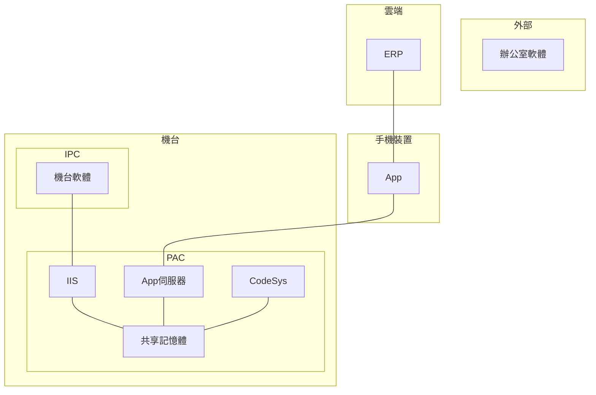
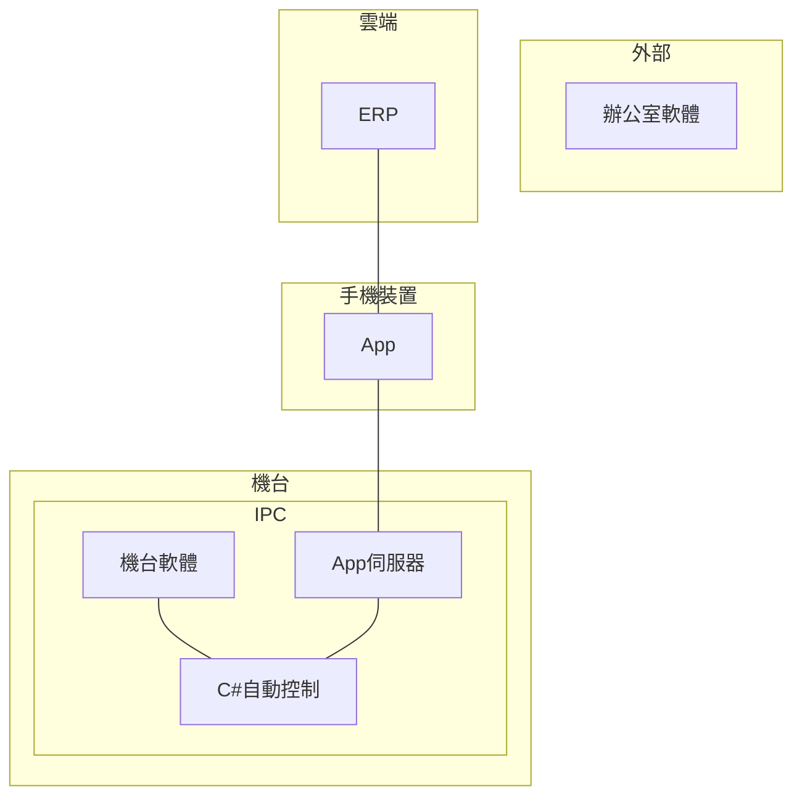
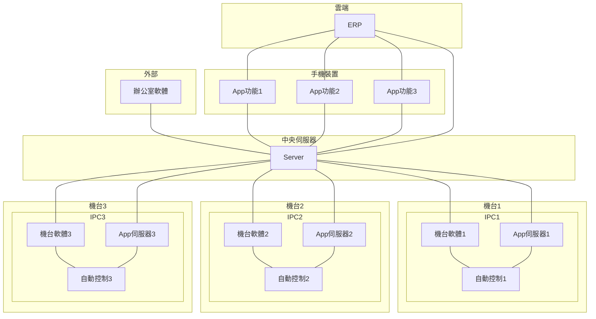
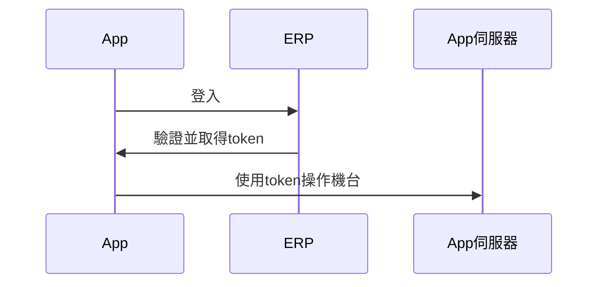
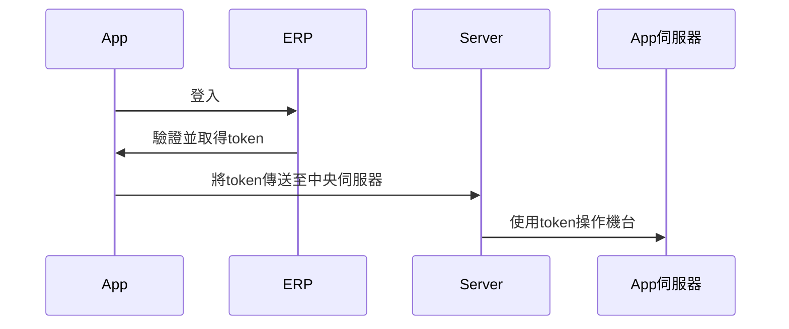
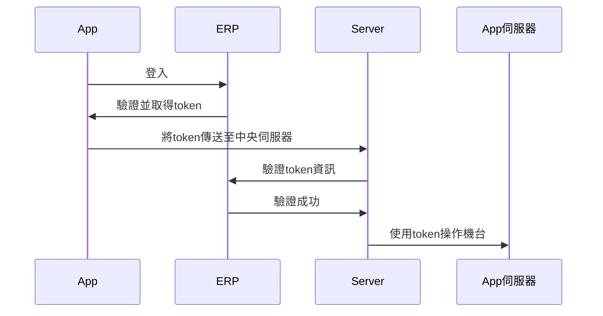
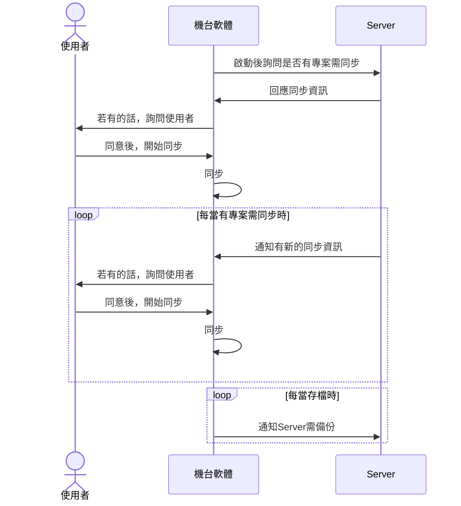
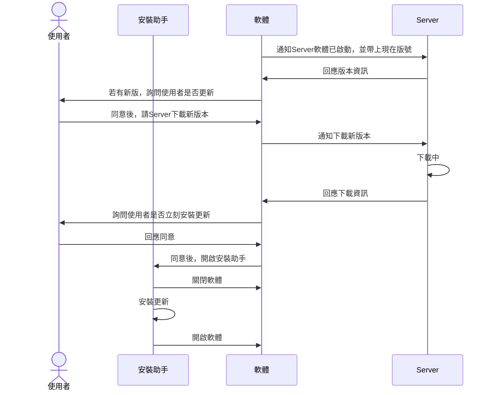
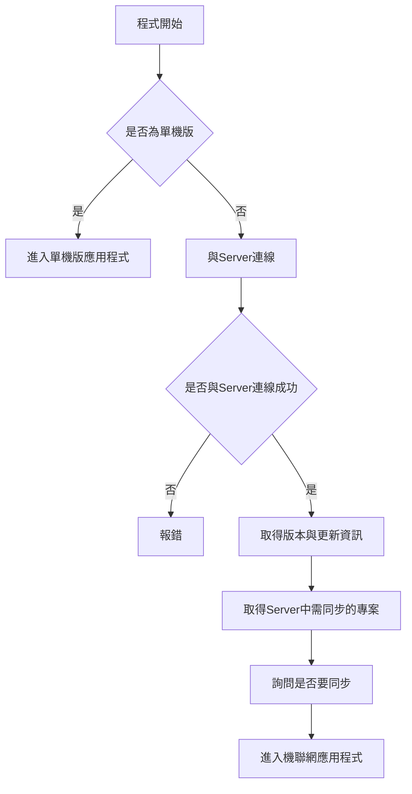

# 單機版與機聯網

## 🔥 單機版配置 (1)

---

## 🔥 單機版配置 (2)

---

## 🔥 機聯網配置

---

## 🔥 單機版 vs 機聯網內網 vs 機聯網外網

| 功能                               | 單機版 | 機聯網內網 | 機聯網外網 |
| ---------------------------------- | ------ | ---------- | ---------- |
| 用 USB 複製專案資料夾至機台軟體    | O      | O          | O          |
| 用 FTP 複製專案資料夾至機台軟體    | O      | O          | O          |
| 用 Server 同步專案資料夾至機台軟體 |        | O          | O          |
| 用 Server 備份專案資料             |        | O          | O          |
| 專案權限分別                       |        | O          | O          |
| 可使用 OTA 更新                    |        |            | O          |
| 可與 ERP 互動                      |        |            | O          |
| 可搜集用戶端資料                   |        |            | O          |

---

## 🔥 單機軟體登入

---

## 🔥 機聯網(內網)軟體登入

---

## 🔥 機聯網(外網)軟體登入

---

## 🔥 辦公室軟體專案同步

---

## 🔥 機台軟體專案同步

---

## 🔥 軟體更新流程

---

## 🔥 軟體流程

---

## 🔥 問題

- 如何分辨是否為單機版？
  - 應用程式本身編譯不同版本
- 單機版版本如何取得更新資訊？
  - 手動更新
- 單機版升級為機聯網版本如何做？
  - 中央 Server 作為 App 伺服器 proxy
