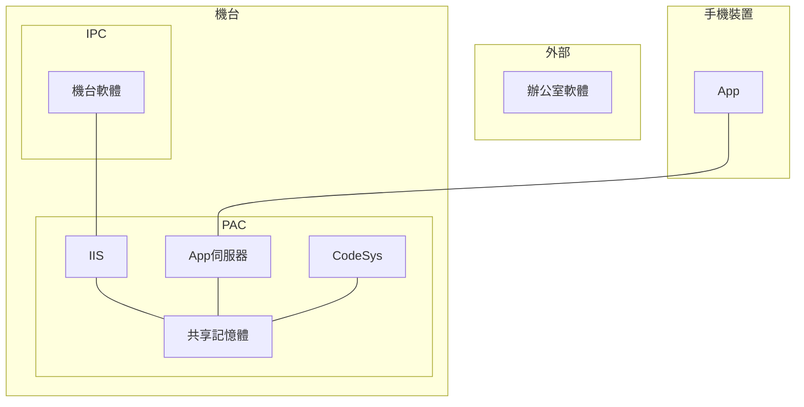
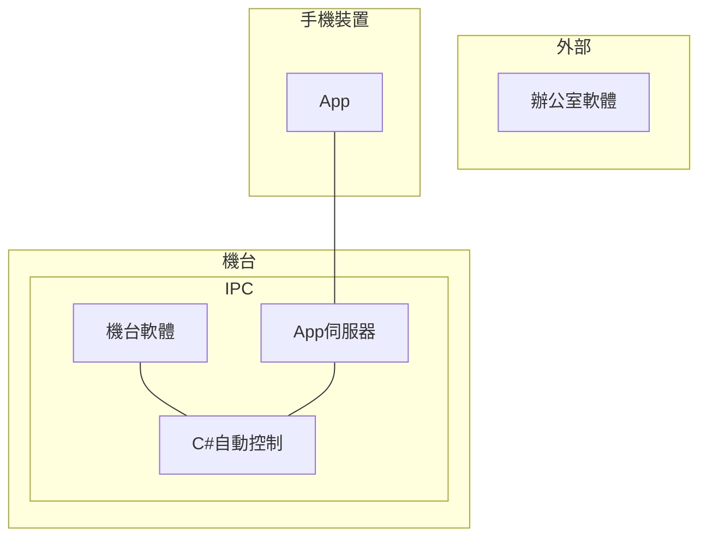
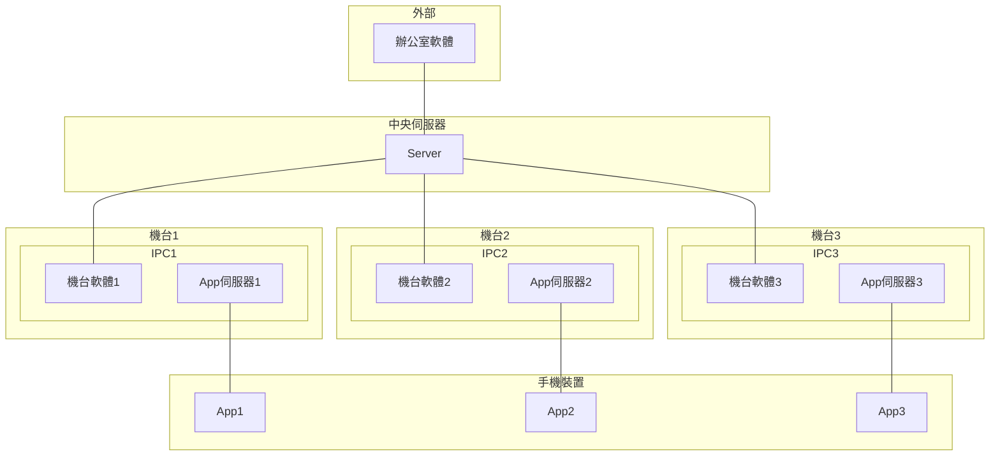

# 單機版與機聯網

## 🔥 單機版配置 (1)

---

## 🔥 單機版配置 (2)

---

## 🔥 機聯網配置

---

## 🔥 單機版 vs 機聯網

| 功能                               | 單機版 | 機聯網 |
| ---------------------------------- | ------ | ------ |
| 用 USB 複製專案資料夾至機台軟體    | O      |O        |
| 用 FTP 複製專案資料夾至機台軟體    | O      | O       |
| 用 Server 同步專案資料夾至機台軟體 |       | O      |
| 用 Server 備份專案資料             |        | O      |
| 可使用 OTA 更新                    |        | O      |
| 可與 ERP 互動                      |        | O      |
| 可搜集庫戶端資料                   |        | O      |
| 專案權限分別                       |        | O      |

---

## 🔥 軟體流程

---

## 🔥 問題

- 如何分辨是否為單機版？
- 單機版版本如何取得(因為在內網)、更新？
- 單機版升級為機聯網版本如何做？
