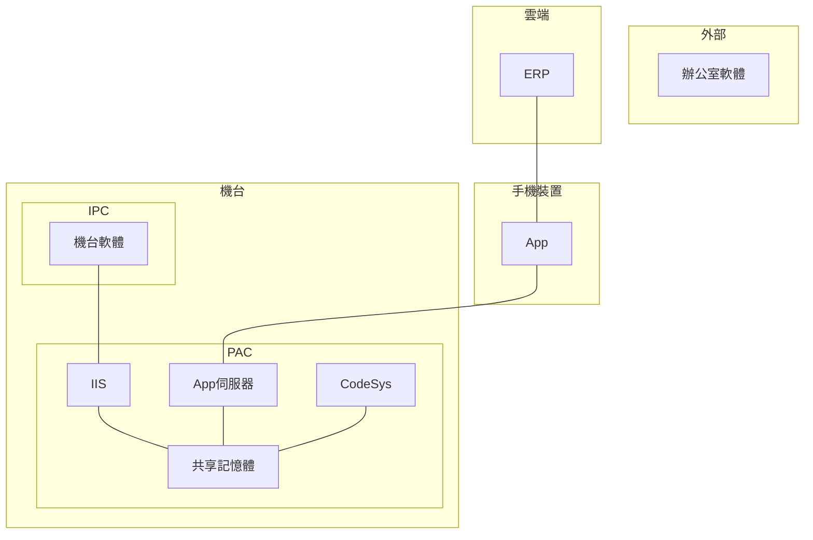
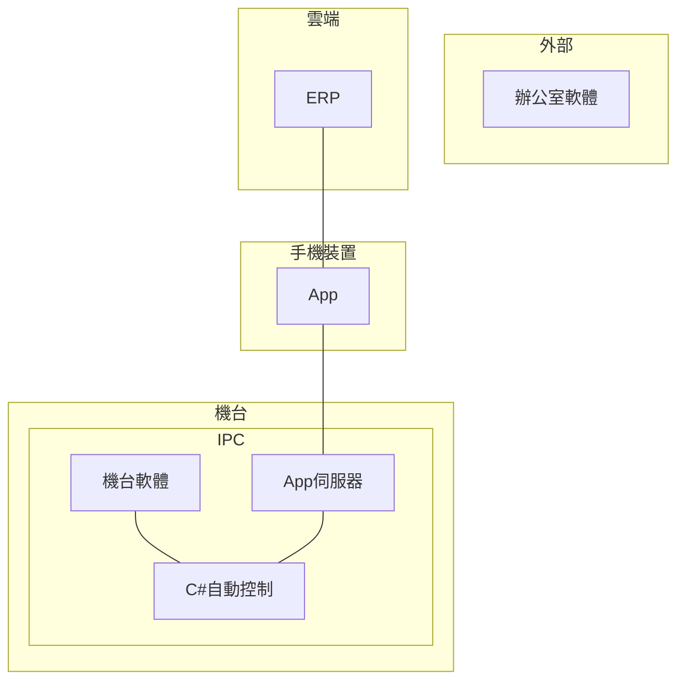
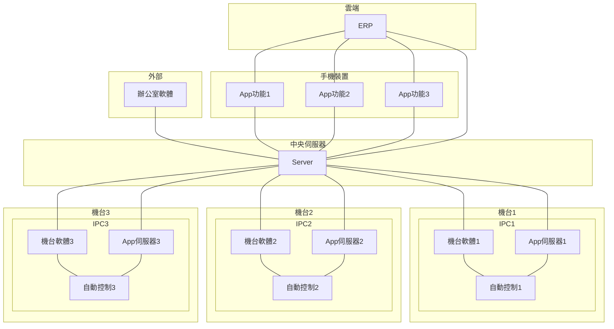

# 軟硬體配置

## 🔥 單機版配置 (1)

```mermaid
flowchart TB
  subgraph 機台
    subgraph PAC
      IIS --- 共享記憶體
      App伺服器 --- 共享記憶體
      CodeSys --- 共享記憶體
    end

    subgraph IPC
      機台軟體 --- IIS
    end
  end

  subgraph 外部
    辦公室軟體
  end

  subgraph 手機裝置
    App --- App伺服器
  end

  subgraph 雲端
    ERP --- App
  end
```

---

## 🔥 單機版配置 (2)

```mermaid
flowchart TB
  subgraph 機台
    subgraph IPC
      機台軟體 --- C#自動控制
      App伺服器 --- C#自動控制
    end
  end

  subgraph 外部
    辦公室軟體
  end

  subgraph 手機裝置
    App --- App伺服器
  end

  subgraph 雲端
    ERP --- App
  end
```

---

## 🔥 機聯網配置

```mermaid
flowchart TB
  subgraph 機台1
    subgraph IPC1
      機台軟體1 --- 自動控制1
      App伺服器1 --- 自動控制1
    end
  end

  subgraph 機台2
    subgraph IPC2
      機台軟體2 --- 自動控制2
      App伺服器2 --- 自動控制2
    end
  end

  subgraph 機台3
    subgraph IPC3
      機台軟體3 --- 自動控制3
      App伺服器3 --- 自動控制3
    end
  end

  subgraph 中央伺服器
    Server --- 機台軟體1
    Server --- 機台軟體2
    Server --- 機台軟體3
    Server --- App伺服器1
    Server --- App伺服器2
    Server --- App伺服器3
  end

  subgraph 外部
    辦公室軟體 --- Server
  end

  subgraph 手機裝置
    App功能1 --- Server
    App功能2 --- Server
    App功能3 --- Server
  end

  subgraph 雲端
    ERP --- App功能1
    ERP --- App功能2
    ERP --- App功能3
    ERP --- Server
  end
```
