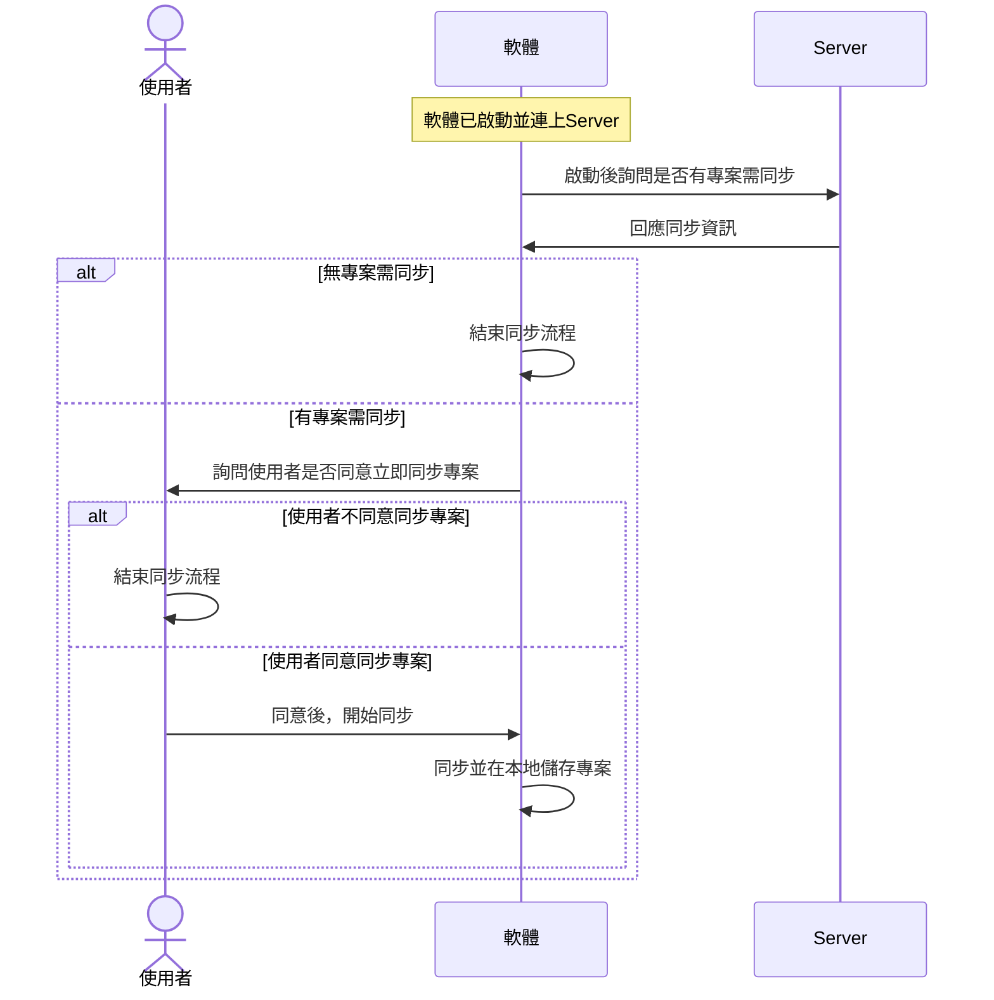
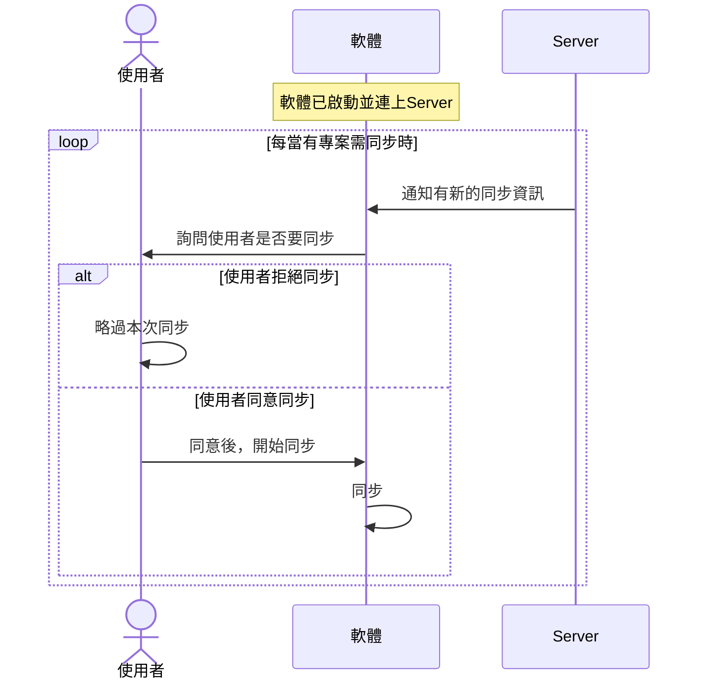
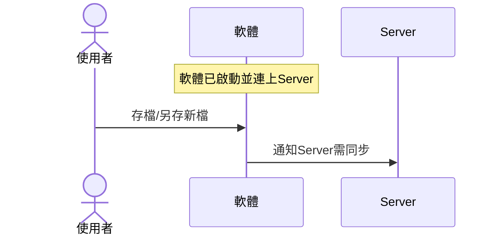
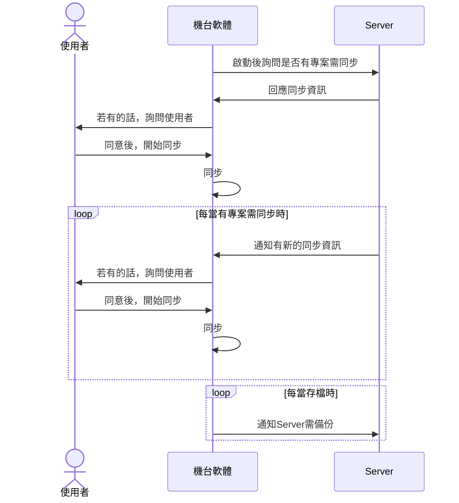

# 軟體專案同步

## 🔥 軟體啟動時

```mermaid
sequenceDiagram
  actor 使用者
  Note over 軟體: 軟體已啟動並連上Server

  軟體 ->> Server: 啟動後詢問是否有專案需同步
  Server ->> 軟體: 回應同步資訊

  alt 無專案需同步
    軟體 ->> 軟體: 結束同步流程
  else 有專案需同步
    軟體 ->> 使用者: 詢問使用者是否同意立即同步專案
    alt 使用者不同意同步專案
      使用者 ->> 使用者: 結束同步流程
    else 使用者同意同步專案
      使用者 ->> 軟體: 同意後，開始同步
      軟體 ->> 軟體: 同步並在本地儲存專案
    end
  end
```

---

## 🔥 軟體收到同步資訊時

```mermaid
sequenceDiagram
  actor 使用者
  Note over 軟體: 軟體已啟動並連上Server

  loop 每當有專案需同步時
    Server ->> 軟體: 通知有新的同步資訊
    軟體 ->> 使用者: 詢問使用者是否要同步

    alt 使用者拒絕同步
      使用者 ->> 使用者:    略過本次同步
    else 使用者同意同步
      使用者 ->> 軟體: 同意後，開始同步
      軟體 ->> 軟體: 同步
    end
  end
```

---

## 🔥 軟體存檔時

```mermaid
sequenceDiagram
  actor 使用者
  Note over 軟體: 軟體已啟動並連上Server

  使用者 ->> 軟體: 存檔/另存新檔
  軟體 ->> Server: 通知Server需同步
```

---

## 🔥 機台軟體專案同步

```mermaid
sequenceDiagram
  actor 使用者

  機台軟體 ->> Server: 啟動後詢問是否有專案需同步
  Server ->> 機台軟體: 回應同步資訊
  機台軟體 ->> 使用者: 若有的話，詢問使用者
  使用者 ->> 機台軟體: 同意後，開始同步
  機台軟體 ->> 機台軟體: 同步

  loop 每當有專案需同步時
    Server ->> 機台軟體: 通知有新的同步資訊
    機台軟體 ->> 使用者: 若有的話，詢問使用者
    使用者 ->> 機台軟體: 同意後，開始同步
    機台軟體 ->> 機台軟體: 同步
  end

  loop 每當存檔時
    機台軟體 ->> Server: 通知Server需備份
  end
```
