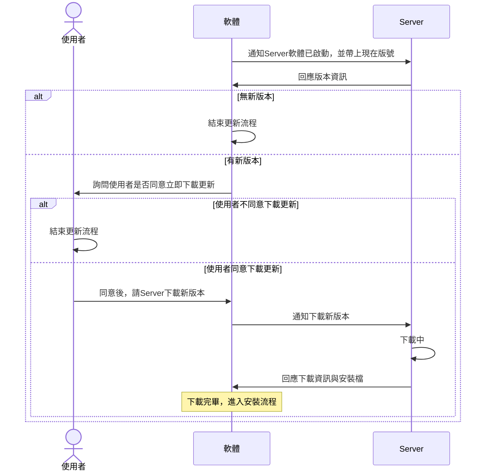
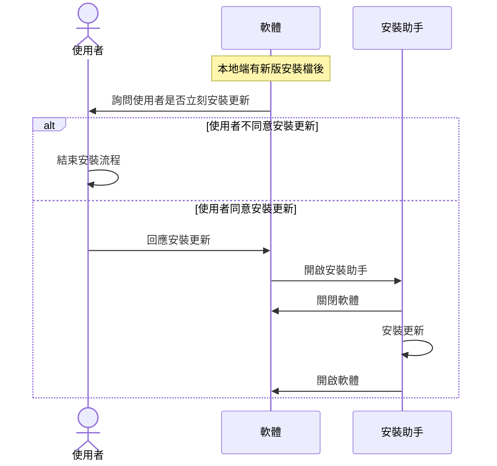

# 軟體更新流程

## 🔥 軟體更新流程

```mermaid
sequenceDiagram
  actor 使用者

  軟體 ->> Server: 通知Server軟體已啟動，並帶上現在版號
  Server ->> 軟體: 回應版本資訊
  alt 無新版本
    軟體 ->> 軟體: 結束更新流程
  else 有新版本
    軟體 ->> 使用者: 詢問使用者是否同意立即下載更新

    alt 使用者不同意下載更新
      使用者 ->> 使用者: 結束更新流程
    else 使用者同意下載更新
      使用者 ->> 軟體: 同意後，請Server下載新版本
      軟體 ->> Server: 通知下載新版本
      Server ->> Server: 下載中
      Server ->> 軟體: 回應下載資訊與安裝檔
      Note over 軟體: 下載完畢，進入安裝流程
    end
  end
```

---

## 🔥 軟體安裝流程

```mermaid
sequenceDiagram
  actor 使用者

  Note over 軟體: 本地端有新版安裝檔後
  軟體 ->> 使用者: 詢問使用者是否立刻安裝更新
  alt 使用者不同意安裝更新
    使用者 ->> 使用者: 結束安裝流程
  else 使用者同意安裝更新
    使用者 ->> 軟體: 回應安裝更新
    軟體 ->> 安裝助手: 開啟安裝助手
    安裝助手 ->> 軟體: 關閉軟體
    安裝助手 ->> 安裝助手: 安裝更新
    安裝助手 ->> 軟體: 開啟軟體
  end
```
