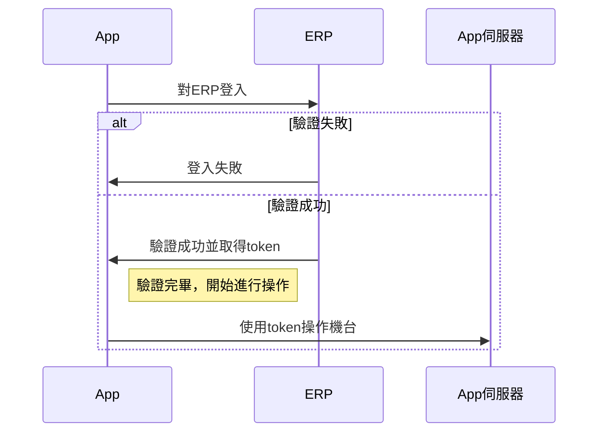
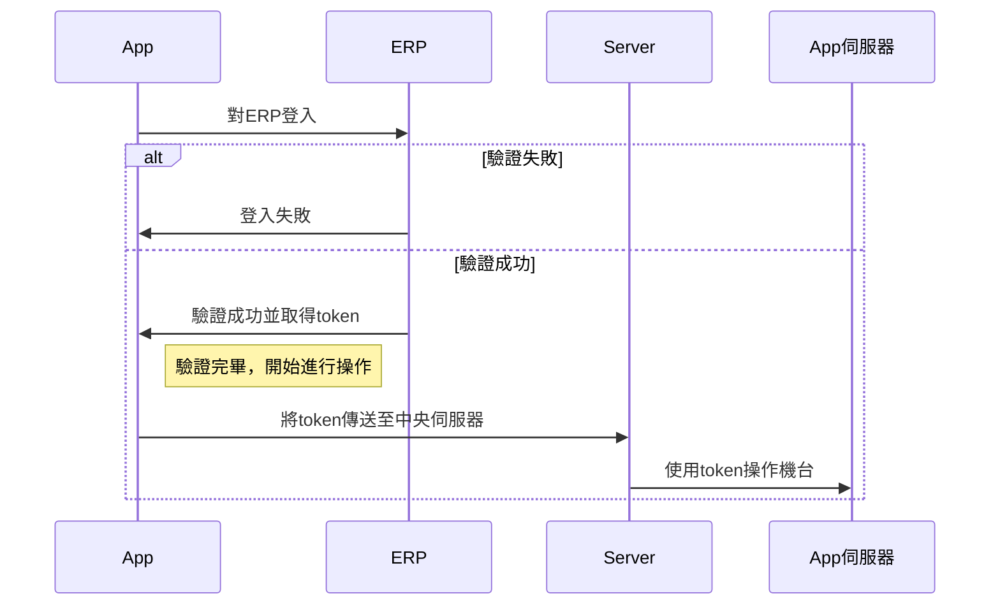
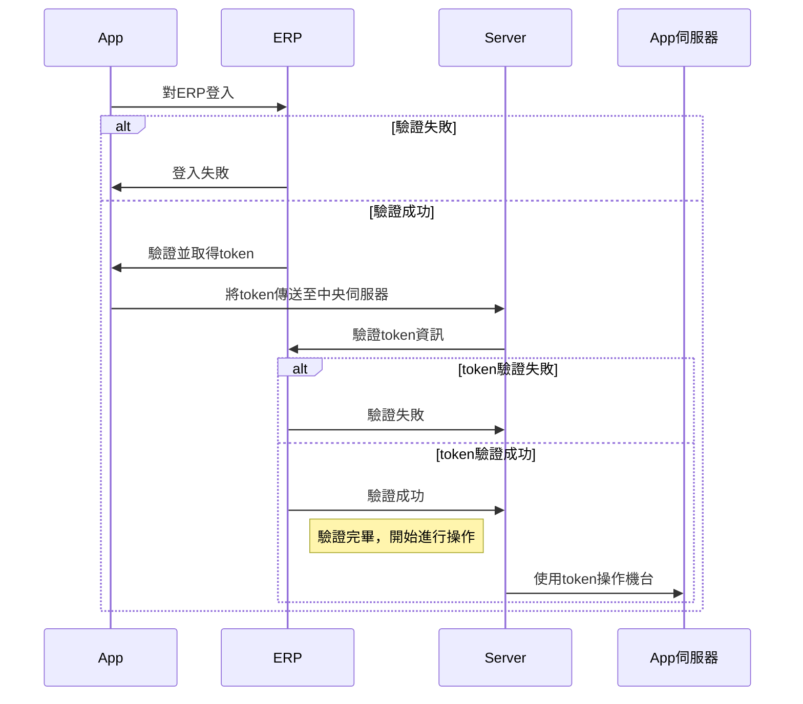

# 軟體登入流程

## 🔥 單機軟體登入

```mermaid
sequenceDiagram
  App ->> ERP: 對ERP登入
  alt 驗證失敗
    ERP ->> App: 登入失敗
  else 驗證成功
    ERP ->> App: 驗證成功並取得token
    Note right of App: 驗證完畢，開始進行操作
    App ->> App伺服器: 使用token操作機台
  end
```

---

## 🔥 機聯網(內網)軟體登入

```mermaid
sequenceDiagram
  App ->> ERP: 對ERP登入
  alt 驗證失敗
    ERP ->> App: 登入失敗
  else 驗證成功
    ERP ->> App: 驗證成功並取得token

    Note right of App: 驗證完畢，開始進行操作
    App ->> Server: 將token傳送至中央伺服器
    Server ->> App伺服器: 使用token操作機台
  end
```

---

## 🔥 機聯網(外網)軟體登入

```mermaid
sequenceDiagram
  App ->> ERP: 對ERP登入
  alt 驗證失敗
    ERP ->> App: 登入失敗
  else 驗證成功
    ERP ->> App: 驗證並取得token
    App ->> Server: 將token傳送至中央伺服器
    Server ->> ERP: 驗證token資訊
    alt token驗證失敗
      ERP ->> Server: 驗證失敗
    else token驗證成功
      ERP ->> Server: 驗證成功
      Note right of ERP: 驗證完畢，開始進行操作
      Server ->> App伺服器: 使用token操作機台
    end
  end
```
