# 辦公室軟體規格

## 🔥 專案管理

### 🔶 畫面規格

- 新增專案
- 匯入專案
- 匯入 NC 檔與 BOM 表
  - 匯入的零件編號若有重複，則會向使用者詢問是否覆蓋或略過或另存
  - NC 檔與 BOM 表中同樣零件編號的零件若有不同資訊，要讓使用者選擇
  - 系統只需處理 BH、RH、槽鐵、方管

---

## 🔥 製品設定

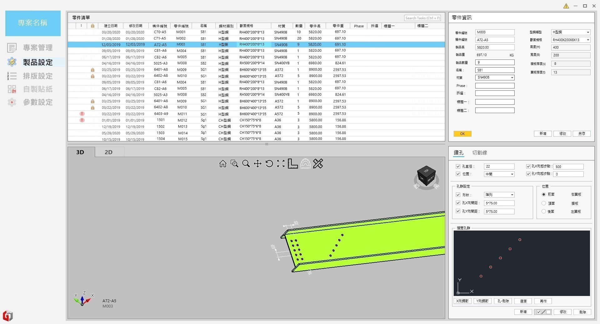

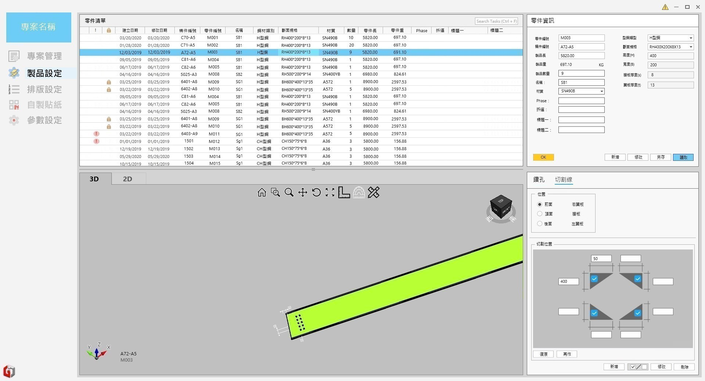

### 🔶 畫面規格

- 零件清單
  - 可鎖定零件
  - 有問題的零件會跳紅色驚嘆號
- 3D 視圖
- 2D 視圖
  - 可顯示標注功能
- 零件資訊
  - 可新增、修改、刪除及另存零件資訊(另存時要要求使用者輸入新的零件編號)
  - 構件編號無作用
- 編輯零件
  - 鑽孔
    - 孔群可作鏡射功能
    - 要有預覽模式
    - 有重複的鑽孔要跳錯誤
  - 切割線
    - 切割線會打上兩個點(會顯示在畫面)

### 🔶 驚嘆號零件

- 當出現鑽孔問題時，無法送至排版

### 🔶 鎖定零件

- 被鎖定的零件可以在視圖中觀看，但不可編輯
- 被鎖定的零件不可以被送至排版

### 🔶 Phase 與托運

- 為 Group

### 🔶 鑽孔細項

- 鑽孔問題
  - 鑽孔新增修改時重複
  - 鑽孔新增修改時進到不可加工區域
  - 鑽孔新增修改時浮空
  - 零件修改時鑽孔服空

### 🔶 切割線細項

- 需依照設定產生切割線上的點

---

## 🔥 排版設定

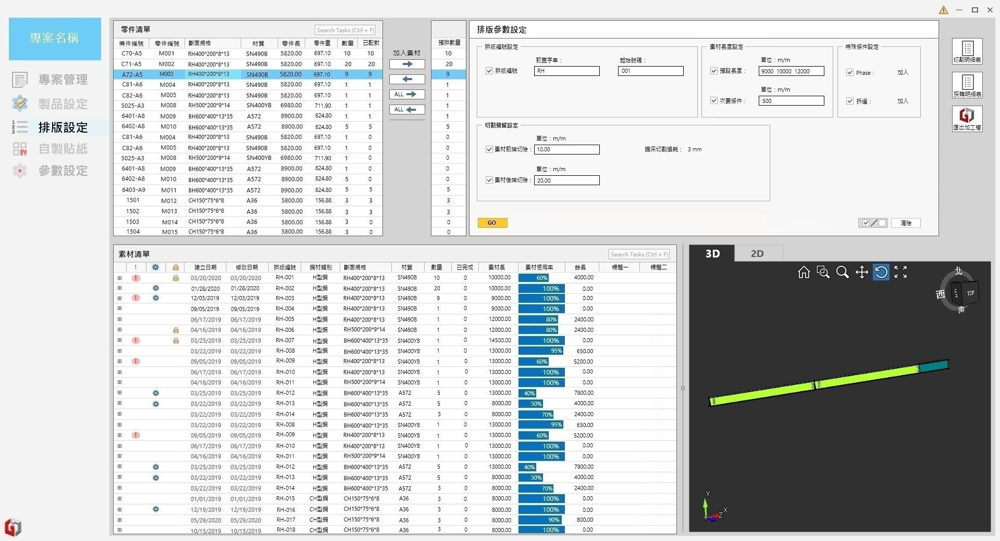

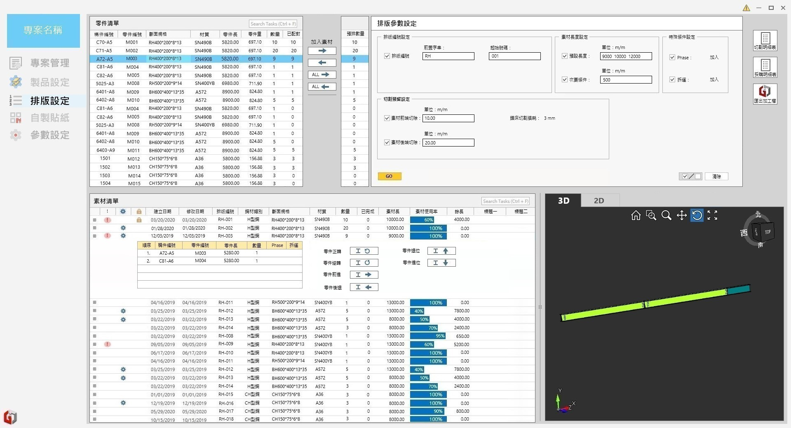

### 🔶 畫面規格

- 零件清單
  - 可一鍵全選欲排版的零件
- 素材清單
  - 可新增與刪除素材
- 排版參數設定
  - 可設定自動排版所需之參數
  - 執行自動排版
- 3D 視圖
  - 預覽排版後的畫面
- 2D 視圖
  - 預覽排版後的畫面
- 報表匯出
  - 切割明細表
  - 採購明細表
- 匯出加工檔

### 🔶 零件清單

- 可按箭頭加入排版
- 可全選欲排版的零件並按箭頭 ALL 加入排版

### 🔶 排版參數設定

- 切割預留設定之切割損耗來自設定畫面
- 切割損耗、餘料、廢料設定
- 特殊條件設定先保持不做事
- 多一項誤差值設定

### 🔶 素材清單

- 驚嘆號表示素材中零件已超過素材長度
- 鎖定零件
- 素材中零件可作新增與刪除

---

## 🔥 自製貼紙

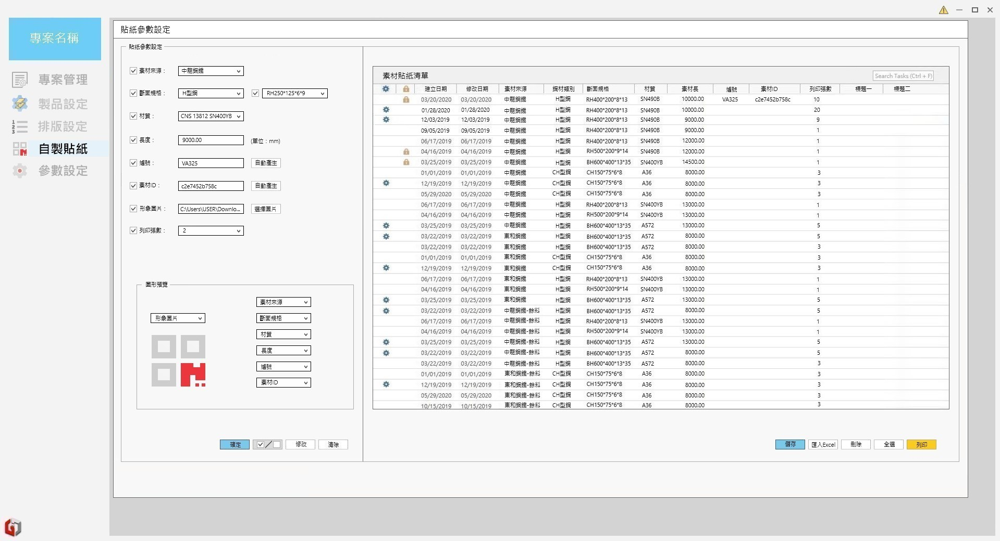

### 🔶 畫面規格

- 依手動輸入或匯入 Excel 來製作清單
- 預設貼紙樣板
- 送至貼紙機列印

### 🔶 待討論

- 貼紙樣板要怎麼儲存、儲存在哪裡

---

## 🔥 參數設定

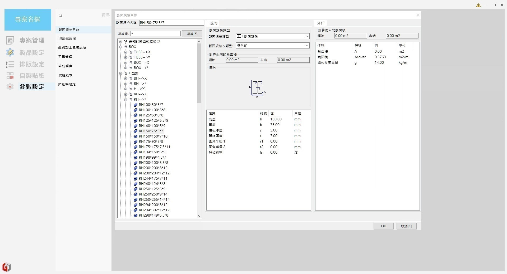
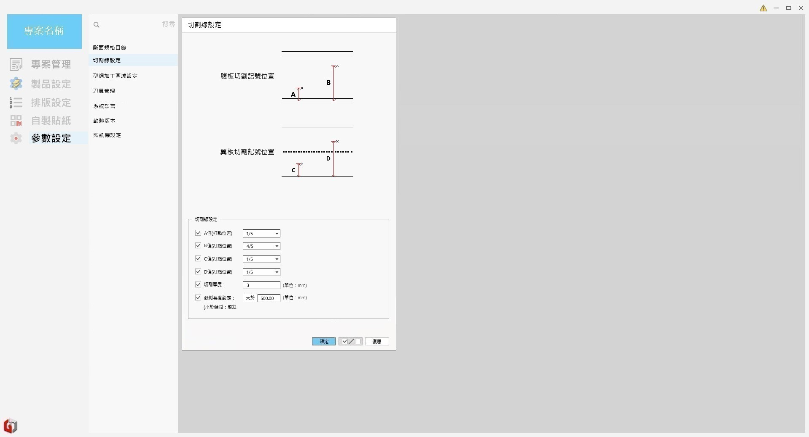
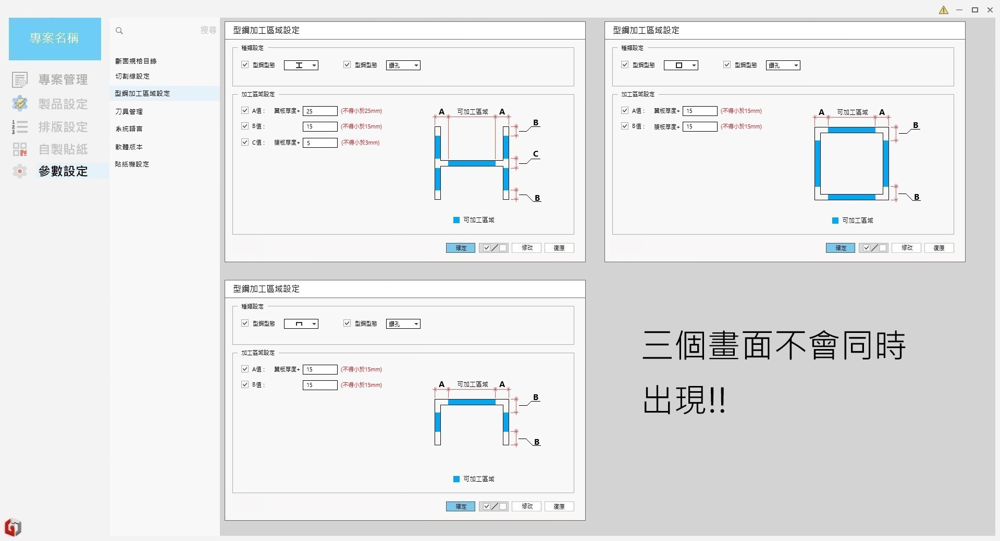
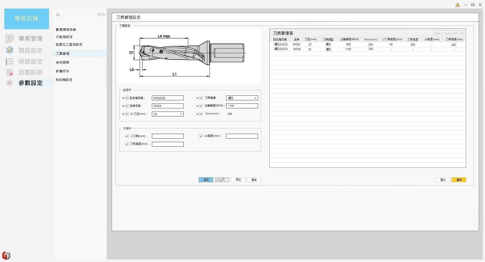

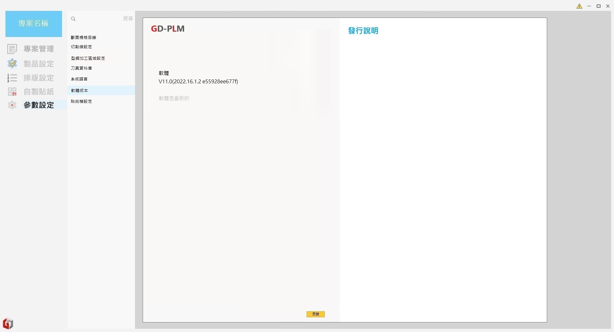
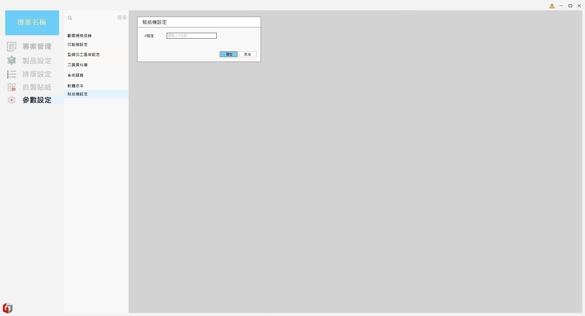

### 🔶 畫面規格

- 斷面規格目錄
  - 規格來自 Tekla
- 切割線設定
  - 需增加餘料與廢料設定
- 型鋼加工區域設定
  - 目前支援三種型鋼
- 刀具管理
  - 匯出資料給機台使用
- 系統語言
  - 目前僅需支援中文版
- 軟體版本
  - 偵測到新版本號要能自動更新
- 貼紙機設定
  - 區網 IP

### 🔶 待討論

- 刀具管理如何跟機台同步
