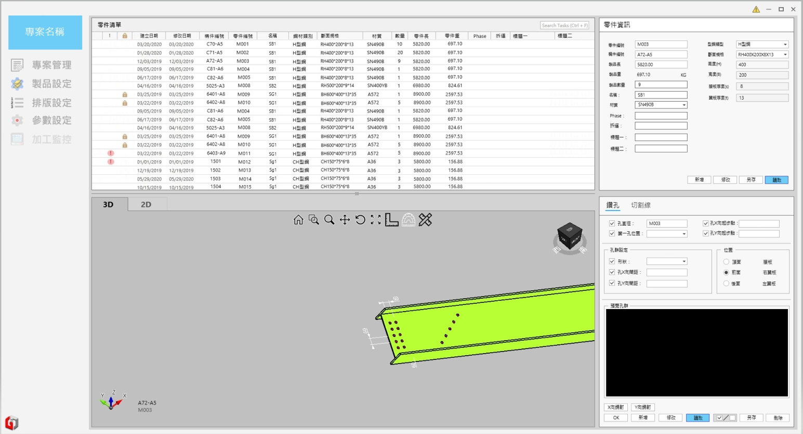
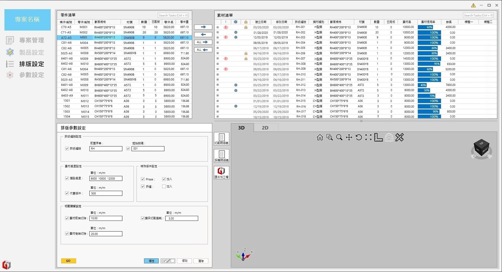

# 辦公室軟體規格

## 🔥 專案管理

- 新增專案
- 匯入專案
- 匯入 NC 檔與 BOM 表
  - 匯入的零件編號若有重複，則會向使用者詢問是否覆蓋或略過或另存
  - NC 檔與 BOM 表中同樣零件編號的零件若有不同資訊，要讓使用者選擇
  - 系統只需處理 BH、RH、槽鐵、方管

---

## 🔥 製品設定

- 零件清單
  - 可鎖定零件
  - 有問題的零件會跳紅色驚嘆號
- 3D 視圖
- 2D 視圖
  - 可顯示標注功能
- 零件資訊
  - 可新增、修改、刪除及另存零件資訊(另存時要要求使用者輸入新的零件編號)
  - 構件編號無作用
- 編輯零件
  - 鑽孔
    - 孔群可作鏡射功能
    - 要有預覽模式
    - 有重複的鑽孔要跳錯誤
  - 切割線
    - 切割線會打上兩個點(會顯示在畫面)

---

## 🔥 排版設定

- 零件清單
  - 可一鍵全選欲排版的零件
- 素材清單
  - 可新增與刪除素材
- 排版參數設定
  - 可設定自動排版所需之參數
  - 執行自動排版
- 3D 視圖
  - 預覽排版後的畫面
- 2D 視圖
  - 預覽排版後的畫面
- 報表匯出
  - 切割明細表
  - 採購明細表
- 匯出加工檔

---

## 🔥 貼紙機

- 預設貼紙樣板
- 依零件清單產生貼紙
- 送至貼紙機列印

---

## 🔥 參數設定
